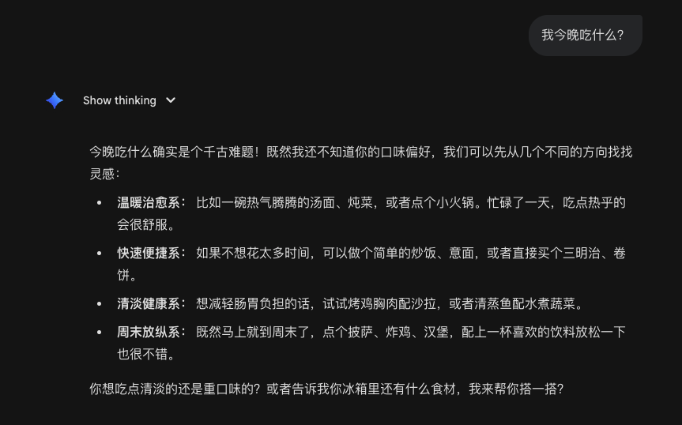

import Info from "../../components/mdx/Info.astro";
import Warning from "../../components/mdx/Warning.astro";
import Success from "../../components/mdx/Success.astro";

`LLM` 越来越强，似乎无所不能。很多人都在期待，只要模型继续迭代升级，未来的 `AI对话` 一定能解决所有问题。

但现实真的如此吗？

当你对着目前最聪明的 `AI` 问出一个极其日常的问题
## 我今晚吃什么？

你会发现，哪怕它进化到了 `GPT 999.0` 或者 `Claude Opus 999.9`，它给你的答案只是一堆排列组合：汉堡、轻食、火锅或是日料。

就算你把世界上所有的菜谱都喂给了一个参数量巨大的 `AI`，此时它确实全知。但当你说“我饿了”时，模型不知道你最近在减脂，也不知道你一吃香菜就会皱眉头。

<Warning>
没有你的专属上下文，最强大的 `AI` 也没有灵魂。
</Warning>

`AI` 拥有了关于你的完整上下文，就像一个时刻配置你的朋友呢？

它拥有你每天吃饭的数据：
- 你今天中午吃了一顿高热量的炸鸡，昨天晚上吃的是披萨。
- 你每次点“健康餐”之前要在软件里犹豫 5 分钟去选菜，但点“烧烤”时只会花 30 秒。
- 你吃到某家外卖后皱着眉头、心情打分甚至心率变化。

这个时候，AI 能从中分析出**连你自己都没意识到的潜在模式**：
1. 它知道你中午热量超标了，今晚潜意识里可能想吃点清淡的以减轻负罪感。
2. 它知道你虽然收藏了一堆沙拉店，但总是犹豫不决，说明你对纯草食并不感冒。
3. 它结合你今天下班较晚的疲惫状态……

最终，它可能会给出这样一个建议：“今晚给你推荐一份温暖的日式鸡汤乌冬面吧。你中午吃得比较油腻，晚上吃这个暖胃；而且那家店就在你回家的路上，不用再花 5 分钟犹豫选哪家了。”

<Success>
This is true intelligence!
</Success>

## Context is All You Need

毕竟，哪怕是 `GPT 999.0`，如果没有你的生活轨迹介入，它也仅仅是个好用的搜索工具而已

AI 模型的算力、参数量和世界知识，决定了它能力的**上限**；但 AI 拥有多少关于你的上下文，决定了它在你生活中的**下限**。