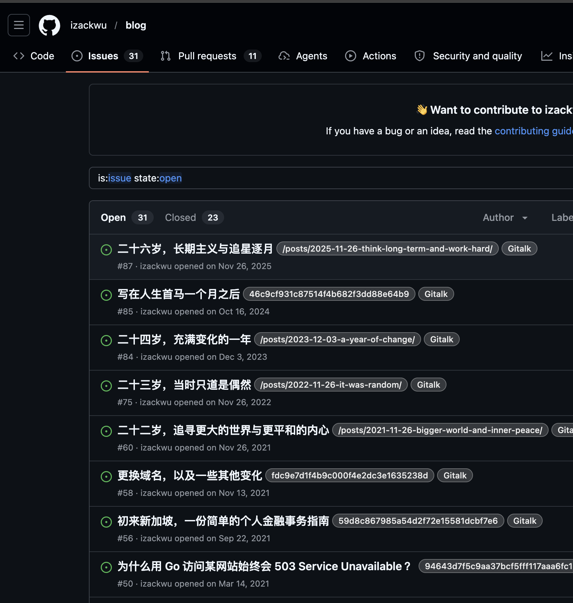
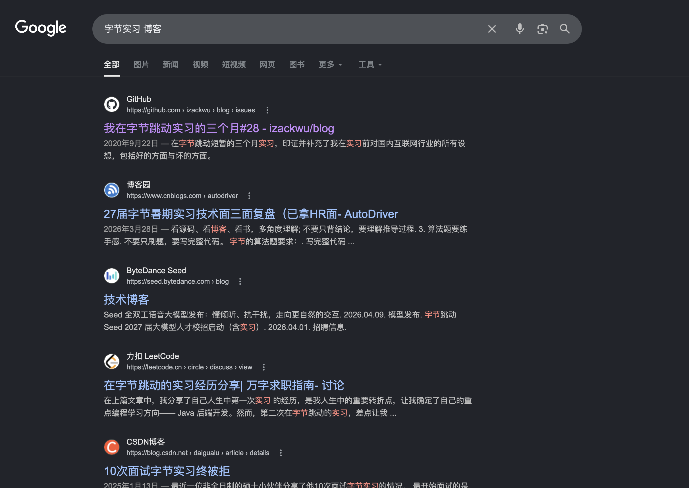

import Info from "../../components/mdx/Info.astro";
import Success from "../../components/mdx/Success.astro";
import Warning from "../../components/mdx/Warning.astro";

最近偶然刷到一个仓库 [izackwu/blog](https://github.com/izackwu/blog/issues)，点进去一看——

> 这哥们的博客文章，全部以 `Issue` 的形式发在 GitHub 仓库里。

我当场愣住，然后忍不住笑出声：**这居然真的可行，而且还相当聪明。**

## 一、先看看他到底是怎么玩的

打开他的 Issues 列表：

- `二十六岁，长期主义与追星逐月`
- `写在人生首马一个月之后`
- `二十四岁，充满变化的一年`
- `二十三岁，当时只道是偶然`
- ……

每一篇都是一个 `Issue`，标题就是文章标题，正文就是 `Markdown` 内容，下面挂着读者的评论。



更骚的操作是：在 Google 里搜 `字节实习 博客`，他那篇 `我在字节跳动实习的三个月 #28` 直接霸占了**第一条**，把一众 `CSDN`、`博客园`、`力扣` 等老牌平台都挤了下去。



## 二、为什么这是个天才方案？

我第一反应是好笑，第二反应是——**卧槽，这思路真是赢麻了。** 让我们冷静地拆一下它到底强在哪。

### 1. SEO 权重：站在巨人的肩膀上

自建博客最痛的痛点是什么？**搜索引擎不收录，或者收录了排在第 8 页。**

你辛辛苦苦写的文章，发在自己 `xxx.com` 的小站上，Google 甚至懒得多看一眼。而 `github.com` 是什么权重？**全球技术内容的圣地之一**，PageRank 高到离谱。

把内容塞进 `github.com/<user>/<repo>/issues/<id>`，相当于直接用 GitHub 这个超级域名给你的内容背书。搜索引擎一看到 `github.com` 就两眼发光，收录速度和排名权重几乎是降维打击。

<Success>
对比一下：你自建博客可能要写一年才积累出域名权重；而 GitHub Issue 几乎是**开局送你一张 SSR 权重卡**。
</Success>

### 2. 原生评论系统：白嫖一套完整 UGC

自建博客想加评论，方案无非这几种：

- **Disqus**：广告满天飞，国内访问不友好。
- **Giscus / Gitalk / Utterances**：本质上还是基于 GitHub Issues / Discussions。
- **自建评论后端**：要数据库、要反垃圾、要登录系统、要邮件通知……一套全家桶下来人都要写吐了。

而 GitHub Issues 自带的评论系统：

- 已经有完整的 **Markdown / 表情 / @mention / 代码高亮**；
- **登录态全平台复用**——所有开发者都有 GitHub 账号；
- **天然反垃圾**——GitHub 自带 spam 检测；
- **邮件通知 / 订阅 / 引用**全部免费打包；
- **永不挂掉**，比你自建的 VPS 稳定一万倍。

你写一行代码都不用，就拥有了一套世界级的评论系统。

### 3. 内容托管：版本控制 + 永久备份

`Issue` 本身就是带版本历史的：

- 谁编辑过、什么时候编辑的、改了什么，**一清二楚**；
- 作为开源仓库还能被 fork、被 archive；
- 你不用关心数据库备份，不用怕磁盘损坏，不用担心服务商跑路。

GitHub 帮你把内容**强制公开 + 永久托管 + 全球分发**，这是任何自建方案都做不到的稳定性。

### 4. 写作体验：Issue 编辑器其实很顺手

GitHub 的 Issue 编辑器其实非常成熟：

- 支持完整 Markdown；
- 可以直接拖图，自动上传到 `user-images.githubusercontent.com`；
- 可以预览；
- 可以从手机网页直接发；
- 草稿可以扔在 Draft 状态，慢慢改。

比起在本地折腾 Hexo / Hugo / Astro 配置 + git push + Vercel 部署的链路，**写一篇 Issue 几乎是零门槛**。

## 三、那"漂亮的个人站"怎么办？

这才是最妙的一步。

> 既然 Issues 已经搞定了 **内容、SEO、评论、备份**，那我自建的博客站还剩什么用？
>
> 答：**用来好看。**

也就是说——

```text
GitHub Issues  →  内容真源（Source of Truth）
       ↓ 构建时 fetch
Astro / Next  →  美观的展示层
       ↓
你自己的域名 + 极致的视觉设计
```

每次构建博客时，只需要：

1. 调用 GitHub REST API：`GET /repos/{owner}/{repo}/issues?state=all&labels=Gitalk`
2. 把每个 Issue 转换成一篇 Markdown 文章；
3. 用你自己的主题、字体、动画、暗色模式渲染出来；
4. 在文章底部嵌入对应 Issue 的评论区（Giscus 即可）。

### 一个最小实现的伪代码

```ts
// scripts/fetch-issues.ts
import { Octokit } from "@octokit/rest";
import fs from "node:fs/promises";

const octokit = new Octokit({ auth: process.env.GH_TOKEN });

const { data: issues } = await octokit.issues.listForRepo({
  owner: "your-name",
  repo: "blog",
  state: "open",
  labels: "post", // 用 label 区分哪些 issue 是博客
  per_page: 100,
});

for (const issue of issues) {
  const frontmatter = `---
title: "${issue.title.replace(/"/g, '\\"')}"
description: "${(issue.body ?? "").slice(0, 80)}"
pubDate: "${issue.created_at}"
updated: "${issue.updated_at}"
issueNumber: ${issue.number}
tags: ${JSON.stringify(issue.labels.map((l: any) => l.name))}
---

${issue.body}
`;
  const slug = `${issue.number}-${slugify(issue.title)}.mdx`;
  await fs.writeFile(`src/content/blog/${slug}`, frontmatter);
}
```

然后在 CI 里加一行：

```yaml
# .github/workflows/deploy.yml
- name: Fetch posts from issues
  run: pnpm tsx scripts/fetch-issues.ts
  env:
    GH_TOKEN: ${{ secrets.GITHUB_TOKEN }}

- name: Build site
  run: pnpm build
```

更进一步，可以监听 `issues` 事件，**Issue 一更新就自动重新部署**：

```yaml
on:
  issues:
    types: [opened, edited, labeled, unlabeled]
  push:
    branches: [main]
```

写完一篇 Issue，回车一发——几分钟后你的个人站就同步上线了。**完全没有"写完文章还要 git commit / push"这一步。**

<Info>
这套架构本质上是把 GitHub 当成了一个免费的 Headless CMS，比 Strapi、Notion API 还好用。
</Info>

## 四、双倍收益：流量入口翻倍

最骚的还在后头。

正常博主只有一个入口：**自己的域名**。

而这套方案下，你拥有**两个独立的、互相导流的入口**：

| 入口 | 优势 | 劣势 |
|---|---|---|
| `github.com/.../issues/N` | SEO 权重高、原生评论、技术圈传播性强 | 样式丑、不能自定义 |
| `yourblog.com/posts/...` | 设计精美、品牌感强、可加分析 | 新域名权重低 |

你只要在两边互相挂个 link：

- Issue 正文最上面写一句：「本文同步发布在 [我的博客](https://yourblog.com/posts/xxx)」
- 博客文章底部写一句：「评论请到 [GitHub Issue #N](https://github.com/.../issues/N)」

**SEO 流量从 GitHub 进，品牌印象在自己站上沉淀，评论又流回 Issue 增加热度。** 形成一个完美的闭环。

## 五、有什么坑吗？

当然，理性地说，这套方案不是没有缺点：

<Warning>
**GitHub 政策风险**：理论上 GitHub 可以封号、可以下架仓库。虽然概率极低，但不是零。建议本地保留一份 Issue 的导出备份。
</Warning>

- **图片托管**：拖到 Issue 里的图片走 `user-images.githubusercontent.com`，速度和稳定性看运气；自己博客站显示时建议**构建时下载到本地**或转存到 CDN。
- **私密草稿**：Issue 一旦创建就是公开的（除非仓库设为私有，但这样就失去 SEO 的意义）。可以用 `draft` label 区分。
- **不适合长篇连载**：Issue 不像 wiki 那样有目录结构，文章太多时管理略乱（不过可以靠 label 和 milestone 解决）。
- **重型 MDX 组件用不了**：在 GitHub 上的 Issue 渲染只有标准 Markdown，那些自定义的 React/Astro 组件只能在自建博客里看到。

## 六、谁特别适合这套方案？

我想了想，这套方案其实有非常清晰的 target user：

1. **技术博主 / 开源作者**：天然在 GitHub 圈子里，读者本来就有账号，评论无门槛。
2. **想要 SEO 但不想运营的人**：你不需要懂 SEO，蹭 GitHub 的权重就够了。
3. **写作频率不高的人**：低频写作不值得搞复杂的 CMS，Issue 简单到像发朋友圈。
4. **多端写作的人**：手机随时打开 GitHub App 就能写，比打开 IDE 改 mdx 文件爽多了。

## 七、写在最后

我以前一直觉得，"博客"就该是一个独立的、精心设计的网站。看到 izackwu 的玩法，我才意识到：

> **博客的本质从来不是"网站"，而是"内容 + 读者"。**
>
> 既然 GitHub 已经把"内容托管 + SEO + 评论 + 通知 + 备份"这一整套基础设施都免费送给你了，那为什么不站在它的肩膀上？

自建博客负责**美感和品牌**，GitHub Issues 负责**内容和分发**——两边各干自己最擅长的事情。

这不是什么炫技，而是一种**对工程懒惰的极致追求**。能用别人的肌肉就别长自己的，这才是真正的工程师精神。

学到了，下次起新博客我也试试这套架构。
