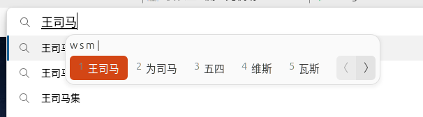

# 前言

众所周知，Ubuntu 对拼音输入法的支持非常不友好，找到一个合适的输入法一直都是一个难题。

在 Ubuntu 24.04 中，默认的拼音输入法是 `IBus`，但是这个输入法非常远古：


比如你要输入 `为什么`，通常来说，你只需要输入 `wsm`，然后选择 `为什么`，但是在 `IBus`中，是这样的：



# 解决方案

上述问题最主要的原因是**词库的缺失**，IBus 的词库非常少，并且非常远古。

## 预设词库

首先可以勾选这几项：


能基本保证正常需求。

## 导入词库

当然，我们也可以考虑从其他输入法/操作系统导入用户数据。

但是很多输入法，例如 `搜狗输入法` 用户数据是非明文的。

这里介绍一个强大的工具：[深蓝词库转换](https://github.com/studyzy/imewlconverter)

以 `搜狗输入法` 为例:


```bash
./ImeWlConverterCmd -i:sgpybin 搜狗词库备份.bin -o:mspy output.txt
```

```output.txt
'yi'jian'bao'kuo 意见包括
'yi'jian'bu'yi 意见不一
'yi'jian'duan 一键端
'yi'jian'sha'gua 一键傻瓜
'yi'jian'shi 一件事
'yi'jie 一节
'yi'jie'ke 一节课
'yi'jin'lai 一进来
'yi'jin'lai 一进来
'yi'jing 已经
'yi'jing 已经
'yi'jing 已经
'yi'jing 意境
'yi'jing'shi 已经是
```

而Ibus的格式是:

```Ibus
个人 ge'ren 5
继续 ji'x 10
继续 ji'xu 55
出问题 chu'wen't 10
出问题 chu'wen'ti 10
了 l 555
了 le 90
重新 chong'x 25
重新 chong'xin 15
生存 sheng'c 40
```

似乎 `Ibus` 记录每次输入，一次是5。

我们这边运行下面的脚本转换一下:

```python
def convert_to_ibus(input_text, default_frequency=40):
    lines = input_text.strip().split('\n')
    ibus_lines = []
    for line in lines:
        line = line.strip()
        if not line:
            continue
        parts = line.split(' ', 1)
        if len(parts) != 2:
            continue
        pinyin, chinese = parts
        if pinyin.startswith("'"):
            pinyin = pinyin[1:]
        ibus_line = f"{chinese} {pinyin} {default_frequency}"
        ibus_lines.append(ibus_line)
    return '\n'.join(ibus_lines)

with open('./tmp/output.txt', 'r', encoding='utf-8') as f:
    input_text = f.read()
result = convert_to_ibus(input_text)
with open('./tmp/convert.txt', 'w', encoding='utf-8') as f:
    f.write(result)
```

我本以为这样就好了，但事实上不是这样的。


Ibus有明显的拼写区分，我们对刚才的文件再次处理:

```txt
博弈论 bo'yi'lun 50000
博弈论 b'y'l 50000
```

```python
def process_line(line):
    parts = line.strip().split(' ')
    if len(parts) >= 3:
        chinese = parts[0]
        pinyin = parts[1]
        freq = parts[2]
        simple_pinyin = ''
        syllables = pinyin.split("'")
        for syllable in syllables:
            if syllable:
                simple_pinyin += syllable[0] + "'"
        if simple_pinyin.endswith("'"):
            simple_pinyin = simple_pinyin[:-1]
        return [line.strip(), f"{chinese} {simple_pinyin} {freq}"]
    return [line.strip()]

with open('./tmp/convert.txt', 'r', encoding='utf-8') as f:
    lines = f.readlines()

result_lines = []
for line in lines:
    if line.strip():
        processed = process_line(line)
        result_lines.extend(processed)

with open('./tmp/convert.txt', 'w', encoding='utf-8') as f:
    f.write('\n'.join(result_lines))
```

还是不行，`wsm` 始终没有出现 `为什么`。

换导入 `码表` 试试。


这个过程中不断重启，一直都没能成功。

```bash
ibus-daemon -drx
```


# 非IBus解决方案

当然我们也可以考虑选择其他输入法解决这个问题。

## 搜狗输入法

`搜狗输入法` 基本可以支持你从 Windows 迁移过来的输入习惯，有拼音纠错，并且可以导入词库。

但是，它的兼容性非常不好，例如在 `Edge` 中，它可能无法正常使用，尽管网上某些方法能解决问题，但偶尔还会再次复发。

## 其他输入法

例如 `fcitx` 也是一个解决方案，不过IBus用起来更像是系统原生的，这就是笔者比较纠结的点。

## deepin操作系统

国产 `deepin` 操作系统对 `搜狗输入法` 的支持非常好，是定制版本。
