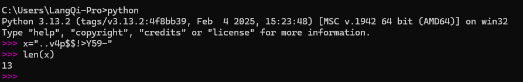
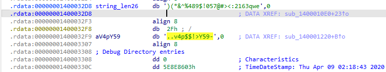

import Collapse from "../../components/mdx/Collapse.astro";
import Diff from "../../components/mdx/Diff.astro";
import Error from "../../components/mdx/Error.astro";
import Info from "../../components/mdx/Info.astro";
import Kbd from "../../components/mdx/Kbd.astro";
import Success from "../../components/mdx/Success.astro";
import Warning from "../../components/mdx/Warning.astro";
import TimeLine from "../../components/mdx/TimeLine.astro";
import LinkCard from "../../components/mdx/LinkCard.astro";

## 题目

[题目链接](https://ctf.show/challenges#%E9%80%86%E5%90%914-250)

CTF Show 20

## 解题

main函数

```c
int __fastcall __noreturn main(int argc, const char **argv, const char **envp)
{
  qword_140004618 = (__int64)malloc(0x10ui64);
  qword_140004620 = qword_140004618;
  *(_QWORD *)(qword_140004618 + 8) = 0i64;
  sub_140001020("请输入正确的数字:\n");
  sub_140001080("%lld");
  ((void (__fastcall __noreturn *)())sub_1400010E0)();
}
```

观察发现是传入flag，然后程序检验flag是否正确

`sub_1400010E0`进行了一系列运算，我基于猜测对变量进行简单重命名和分析

```c
void __fastcall __noreturn sub_1400010E0(char *input, __int64 a2)
{
  int length; // r9d
  __int64 copy_input; // r8
  char *addr_index; // r10
  char content; // al
  __int64 copy_length; // rbx
  char v7; // cl
  char v8; // [rsp+1Fh] [rbp-3F9h]
  char zero; // [rsp+20h] [rbp-3F8h] BYREF

  length = 0;
  copy_input = (__int64)input;
  if ( input )
  {
    addr_index = &zero;
    do
    {
      ++addr_index; //这里很明显是给一片连续内存写入经过处理后的string_len26
      ++length; //记录长度
      content = string_len26[copy_input + -26 * (copy_input / 26)];
      copy_input /= 26i64;
      *(addr_index - 1) = content; //这里很明显是给一片连续内存写入经过处理后的string_len26
    }
    while ( copy_input );
  }
  copy_length = length;
  while ( copy_length )
  {
    v7 = *(&v8 + copy_length--);
    sub_1400011E0(v7 ^ 7);
  }
  sub_140001220();
}
```

---

```c
do
{
    ++addr_index;
    ...
    *(addr_index - 1) = content; 
}
while ( copy_input );
```

这里很明显是给一片连续内存写入经过处理后的 `string_len26`

---

```c
do
{
    content = string_len26[copy_input + -26 * (copy_input / 26)];
    copy_input /= 26i64;
}
while ( copy_input );
```

这里我看了很久，整理一下逻辑就是，`copy_input`每次会除以26，然后取出 `content`

至于 `string_len26[copy_input + -26 * (copy_input / 26)]`

展开有 `copy_input - copy_input`这显然不对，因为 `copy_input / 26`是向下取整的

实际上这个表达式等价于：

$$
x \bmod 26
$$

这是因为：

$$
x - 26 \times \lfloor \frac{x}{26} \rfloor = x \bmod 26
$$

所以这就是个26 `进制转换`，表是 `string_len26`

我不知道为什么 $\LaTeX$ 会以不同的形式渲染两遍，可能是 _MDX_ 的渲染机制导致的，这可能导致这部分看起来很奇怪。

如果有大佬知道为什么，请在Issue中告诉我，谢谢。

---

```c
_QWORD *__fastcall sub_1400011E0(char a1)
{
  _QWORD *addr_result; // rax
  __int64 v3; // rdx

  addr_result = malloc(0x10ui64); // 分配内存 16字节，可存储2个QWORD(每个QWORD为8字节，即64位)
  v3 = qword_140004618; // 获取链表头
  qword_140004618 = (__int64)addr_result; // 更新链表头
  *(_QWORD *)(v3 + 8) = addr_result; // 将新节点添加到链表头部
  *(_BYTE *)v3 = a1; // 设置新节点的值
  addr_result[1] = 0i64; // 设置新节点的下一个节点为NULL
  return addr_result;
}
```

第一次接触逆向的伪代码，这部分看得也十分吃力，丢给gpt了

告诉我是个 `链表`，我一看，确实。

不过这部分似乎不重要。

---

```c
void __noreturn sub_140001220()
{
  __int64 v0; // r9
  int v1; // ecx
  __int64 v2; // rdx
  char v3; // al
  int v4; // r8d
  __int64 v5; // r9
  char v6; // cl
  int v7; // eax

  v0 = qword_140004620;
  v1 = 0;
  v2 = 0i64;
  while ( 1 )
  {
    v3 = *(_BYTE *)v0;
    v4 = v1 + 1;
    v5 = *(_QWORD *)(v0 + 8);
    if ( v3 != aV4pY59[v2 - 1] )
      v4 = v1;
    qword_140004620 = v5;
    if ( !v5 )
      break;
    v6 = *(_BYTE *)v5;
    v7 = v4 + 1;
    v0 = *(_QWORD *)(v5 + 8);
    if ( v6 != aV4pY59[v2] )
      v7 = v4;
    qword_140004620 = v0;
    if ( v0 )
    {
      v2 += 2i64;
      v1 = v7;
      if ( v2 < 14 )
        continue;
    }
    goto LABEL_11;
  }
  v7 = v4;
LABEL_11:
  if ( v7 == 14 )
    sub_1400012E0();
  sub_1400012B0();
}
```

这里发现 `aV4pY59`是 `..v4p$$!>Y59-`，两位两位取的，判断匹配数是否为14



不过发现这只有13个，少了一个，看代码发现索引从-1开始



这里也是参考了Writeup，前面要补一个 `/`

## 代码

```python
s1 = "/..v4p$$!>Y59-"
s2 = ")(*&^%489$!057@#><:2163qwe"

xor7 = [chr(ord(i) ^ 7) for i in s1]
# xor7.reverse()
result = 0
for i in xor7:
    num = s2.index(i)
    result *= 26
    result += num
print(result)
```

## 总结

- 26进制转换
- 链表

写完blog之后感觉这题也就这样吧，可能还是我太菜了。

