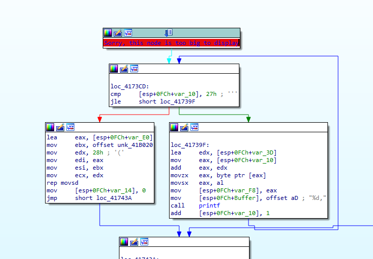
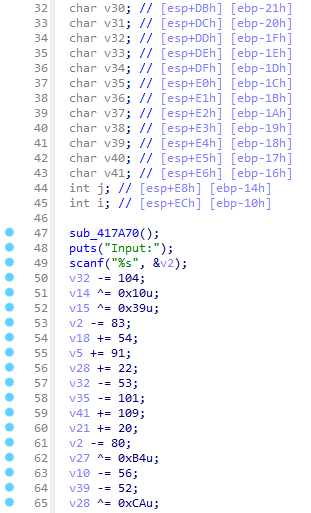
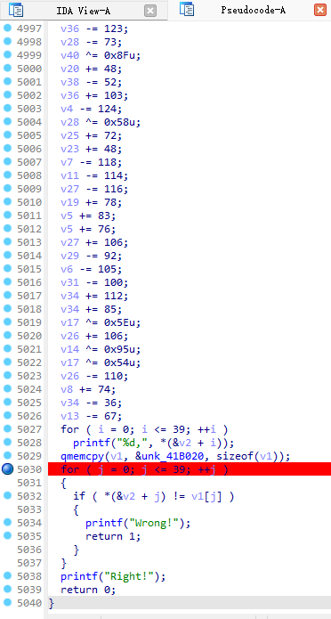
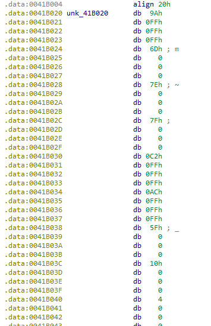
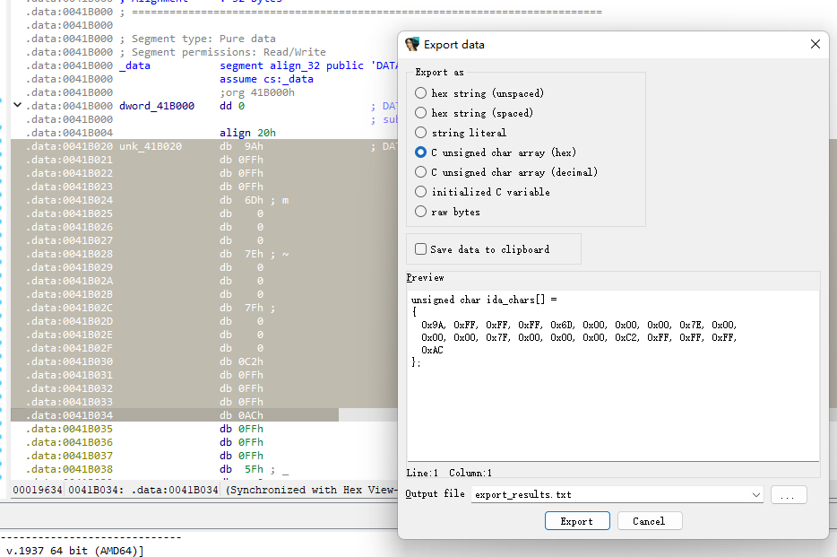
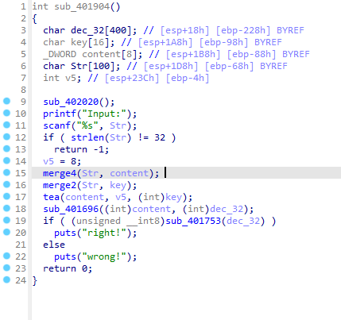
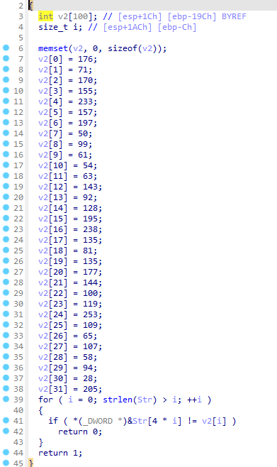

import Collapse from "../../components/mdx/Collapse.astro";
import Diff from "../../components/mdx/Diff.astro";
import Error from "../../components/mdx/Error.astro";
import Info from "../../components/mdx/Info.astro";
import Kbd from "../../components/mdx/Kbd.astro";
import Success from "../../components/mdx/Success.astro";
import Warning from "../../components/mdx/Warning.astro";
import TimeLine from "../../components/mdx/TimeLine.astro";
import LinkCard from "../../components/mdx/LinkCard.astro";

# ezMath

## 题目

[题目链接](http://210.30.97.133:8000/challenges#ezMath-222)

SSSCTF ezMath 1

## 解题

开局 <Kbd>Shift </Kbd>+<Kbd>F12 </Kbd>，找到flag检验


然后喜报



<Warning>Sorry, this node is too big to display </Warning>

这个节点太大了，显示不了，但是可以修改 `IDA/cfg/hexrays.cfg`的 `MAX_FUNCSIZE`，默认应该是64，改成1024即可





发现就是个加加减减然后和一个东西比较

那个东西是



我做的时候还不会提取这玩意

```python
res = []
with open("t.log", "r") as f:
    s = f.read()
    count = 0
    rcount = 0
    tmp = ""
    for line in s.split("\n"):
        line = line.split("db ")
        line = line[1][1:4].replace("h", "").replace(" ", "")
        count += 1
        tmp = line + tmp
        if count % 4 == 0:
            rcount += 1
            res.append(tmp)
            tmp = ""
        if rcount == 40:
            break

for i in range(40):
    print(f"v{i} = 0x{res[i]}")
```

原来 <Kbd>Shift </Kbd>+<Kbd>E </Kbd> 要选中数据才能提取



接下来就是解密，我们发现这些数经过一些加减然后再比较

那么我们直接逆回去，把比较的数加减回去，然后就可以得到flag

具体实现上，就是倒着运行代码，然后加换减，减换加

```python
import logging

# 配置日志
logging.basicConfig(
    level=logging.INFO,
    format='%(asctime)s - %(levelname)s - %(message)s',
    handlers=[
        logging.FileHandler('solve.log'),
        logging.StreamHandler()
    ]
)

logger = logging.getLogger(__name__)

ans0 = 0xFFFFFF9A
ans1 = 0x0006D
ans2 = 0x0007E
....
ans38 = 0xFFFFFFED
ans39 = 0x00035
for i in range(2, 42):
    exec(f"v{i} = ans{i-2}")
with open("ori", "r") as f:
    s = f.read()
    lines = s.split("\n")
    lines.reverse()
    for line in lines:
        if "+=" in line:
            line = line.replace("+=", "-=")
        elif "-=" in line:
            line = line.replace("-=", "+=")
        elif "++" in line:
            line = line.split("++")
            line = line[1] + "-=1"
        elif "--" in line:
            line = line.split("--")
            line = line[1] + "+=1"
        exec(line)
        # logger.info(line)
for i in range(2, 42):
    exec(f"print(chr(v{i}%256),end='')")

```

## 坑

- 代码里面有少量的++v和--v 而非v+=14 5000行里只有10+个
- 不要`line.replace("+=", "-=").replace("-=", "+=")`

# TEA

## 题目

[题目链接](http://210.30.97.133:8000/challenges#TEA-264)

flag用 `sssctf{}`包裹

## 解题

开局仍然是 <Kbd>Shift </Kbd>+<Kbd>F12 </Kbd>跟上面一样找到入口



我们一个一个看

```c
printf("Input:");
scanf("%s", Str);
if ( strlen(Str) != 32 )
  return -1;
```

输入长度必须为32，然后我们看下面 `merge4`函数

```c
/*
char Str[100];
0 1 2 3 4 5 6 7 8 9 a b c d e f
(0) (1) (2) (3) (4) (5) (6) (7) (8) (9) (a) (b) (c) (d) (e) (f)
*/
int *__cdecl sub_4015AA(int a1, int a2)
{
  int *result; // eax
  int i; // [esp+Ch] [ebp-4h]

  for ( i = 0; i <= 7; ++i )
  {
    result = (int *)(4 * i + a2);
    /*
        #offset: 0 4 8 c
        #type: int* 4 bytes
    */
    *result = *(char *)(4 * i + 3 + a1) | (((((*(char *)(4 * i + a1) << 8) | *(char *)(4 * i + 1 + a1)) << 8) | *(char *)(4 * i + 2 + a1)) << 8);
    /*
        #addr:    0         4         8         c
        #offset: (0 1 2 3) (4 5 6 7) (8 9 a b) (c d e f)
    */
  }
  return result;
  /*
      _DWORD content[8];
      0 1 2 3 4 5 6 7 8 9 a b c d e f
      (0 1 2 3) (4 5 6 7) (8 9 a b) (c d e f)
  */
}
```

这里我画了内存的表，也就是说把char[32]转换成int[8]存到content

然后看 `merge2`函数

```c
/*
char Str[100];
0 1 2 3 4 5 6 7 8 9 a b c d e f
(0) (1) (2) (3) (4) (5) (6) (7) (8) (9) (a) (b) (c) (d) (e) (f)
*/

for ( i = 0; i <= 3; ++i )
{
    result = (int *)(4 * i + a2);
    /*
        #offset: 0 4 8 c
        #type: int* 4 bytes
    */

    *result = *(char *)(2 * i + 1 + a1) | (*(char *)(2 * i + a1) << 8); 
    /*
        #addr:    0         4         8         c
        #offset: (0 0 0 1) (0 0 2 3) (0 0 4 5) (0 0 6 7)
    */
}
/*
char key[16];
0 1 2 3 4 5 6 7 8 9 a b c d e f
(0) (0) (0) (1) (0) (0) (2) (3) (0) (0) (4) (5) (0) (0) (6) (7)
*/
```

这里把char[32]存到char[16] 不过发现这里key只用到了**前8个字节** 也就是前八个char

`tea`函数先放着不管

`sub_401696((int)content, (int)dec_32);`在这

```c
char Str[100]->Str[32]
char dec_32[400];
for ( i = 0; i <= 7; ++i )
{
    *(_DWORD *)(dec_32 + 16 * i) = HIBYTE(*(_DWORD *)(4 * i + content));
    *(_DWORD *)(dec_32 + 16 * i + 4) = (unsigned __int8)BYTE2(*(_DWORD *)(4 * i + content));
    *(_DWORD *)(dec_32 + 16 * i + 8) = (unsigned __int8)BYTE1(*(_DWORD *)(4 * i + content));
    *(_DWORD *)(dec_32 + 16 * i + 12 ) = (unsigned __int8)*(_DWORD *)(4 * i + content);
}
-user:
这在做什么 简单直观概括

-4o:
这段代码的作用是：**将一个 32 字节的缓冲区（`content` 指向）中的每 4 字节（一个 `DWORD`）分拆成字节后重新排列，并以 16 字节为单位写入另一个缓冲区 `dec_32` 中。**

简单直观地说就是：

👉 **每4字节拆成4个字节，按从高到低的顺序重新按列排布到新的内存中，每次写入16字节，共8组。**

例如：
假设 `content` 里的前4字节是 `0xAABBCCDD`，这段代码会把：
- `AA`（高字节）放到新位置的偏移0
- `BB` 放偏移4
- `CC` 放偏移8
- `DD` 放偏移12
然后处理下一个4字节，再放入下一组16字节，以此类推，重复8次。

结果：把原始的"按行排列"的结构，变成了"按列排列"的结构，有点类似矩阵转置那种感觉。适合于后续的加密或解码处理。
```

这是比较函数



所以我们立马就能
```python
v2 = [0]*32
v2[0] = 176
v2[1] = 71
...
v2[28] = 58
v2[29] = 94
v2[30] = 28
v2[31] = 205
encrypt_data = [0]*8
for i in range(8):
    encrypt_data[i] = v2[i*4] << 24 | v2[i*4+1] << 16 | v2[i*4+2] << 8 | v2[i*4+3]
```

我们知道加密是需要密钥的，这里分析一下并总结

- 明文是由我们输入的32字节
- 密钥是明文的前8个字节
- 加密函数是`TEA`
- 密文是`encrypt_data`

还记得题目一开始说的吗，flag是`sssctf{}`包裹的，所以密钥的前7个字节是`sssctf{`，只需爆破最后一个字节即可
```python
guess = []
guess += [chr(i) for i in range(ord('a'), ord('z')+1)]
guess += [chr(i) for i in range(ord('A'), ord('Z')+1)]
guess += [chr(i) for i in range(ord('0'), ord('9')+1)]
guess += ['!', '@', '#', '$', '%', '^', '&', '*',
          '(', ')', '-', '_', '+', '=', '{', '}', '[', ']', '|', ':', ';', ',', '.', '/', '?', '~'] # 这一行是ai补全的 我不确定有没有这么多
```

然后看`tea`函数

```c
unsigned int __cdecl tea(_DWORD *ori, int a2, int key)
{
  unsigned int *v3; // eax
  unsigned int *v4; // eax
  unsigned int result; // eax
  int v6; // [esp+Ch] [ebp-1Ch]
  int index; // [esp+10h] [ebp-18h]
  unsigned int i; // [esp+14h] [ebp-14h]
  unsigned int v9; // [esp+18h] [ebp-10h]
  unsigned int v10; // [esp+1Ch] [ebp-Ch]

  if ( a2 > 1 )
  {
    index = 52 / a2 + 6;                        // 12
    v9 = 0;
    v10 = ori[a2 - 1];
    do
    {
      v9 -= 1640531527;
      v6 = (v9 >> 2) & 3;
      for ( i = 0; i < a2 - 1; ++i )
      {
        v3 = &ori[i];
        *v3 += ((ori[i + 1] ^ v9) + (v10 ^ *(_DWORD *)(4 * (v6 ^ i & 3) + key))) ^ (((4 * ori[i + 1]) ^ (v10 >> 5))
                                                                                  + ((ori[i + 1] >> 3) ^ (16 * v10)));
        v10 = *v3;
      }
      v4 = &ori[a2 - 1];
      *v4 += ((*ori ^ v9) + (v10 ^ *(_DWORD *)(4 * (v6 ^ i & 3) + key))) ^ (((4 * *ori) ^ (v10 >> 5))
                                                                          + ((*ori >> 3) ^ (16 * v10)));
      result = *v4;
      v10 = result;
      --index;
    }
    while ( index );
  }
  return result;
}
```
这玩意里面挺混淆的，我头发耗光了把那一堆东西化简成这样，自己都没想到能如此简洁，这该不会是**re的精髓**吧

```c
index = 12;
sum = 0;
o7 = ori[7];
do
{
    sum -= 0x61C88647;
    sum2 = (sum >> 2) & 3;
    for (i=0; i < 7; ++i)
    {
        ori[i] += ((ori[(i+1) % 8] ^ sum) + (ori[(i-1) % 8] ^ *(_DWORD *)(4 * (sum2 ^ i & 3) + key))) ^ (((4 * ori[(i+1) % 8]) ^ (ori[(i-1) % 8] >> 5)) + ((ori[(i+1) % 8] >> 3) ^ (16 * ori[(i-1) % 8])));
    }
    --index;
}
while (index);
```

接下来参考了文章[tea 加密解密算法（面向ctf-reverse使用，光速学会tea逆向套路）](https://blog.csdn.net/liKeQing1027520/article/details/141287289)

(实际上在化简前就看文章了 耗了大半天一直觉得我遇到的这个TEA是超级复杂的TEA)

tea解密其实跟上面那道题类似，仍然是倒着运行，然后加换减，减换加

这里异或就不用管了，因为异或的逆运算就是异或，和上面一题一样

`sum`的初始值是`0x61C88647 * -index`

然后`python`的话注意要手动溢出`& 0xFFFFFFFF`

```python 
for ch in guess:
    key_str = "sssctf{"+ch  # 8 char
    key = [0]*4
    for i in range(0, 4):
        key[i] = ord(key_str[i*2+1]) | (ord(key_str[i*2]) << 8)
        # TEA解密
        ori = encrypt_data.copy()
        index = 12
        sum = (0x61C88647 * -index) & 0xFFFFFFFF
        while index > 0:
            sum2 = (sum >> 2) & 3
            for i in range(7, -1, -1):
                ori[i] -= ((ori[(i+1) % 8] ^ sum) + (ori[(i-1) % 8] ^ key[sum2 ^ (i & 3)])) ^ (
                    ((4 * ori[(i+1) % 8]) ^ (ori[(i-1) % 8] >> 5)) + ((ori[(i+1) % 8] >> 3) ^ (16 * ori[(i-1) % 8])))
                ori[i] &= 0xFFFFFFFF
            sum += 0x61C88647
            sum &= 0xFFFFFFFF
            index -= 1
        # output:
        decrypted_text = ""
        for value in ori:
            decrypted_text += chr((value >> 24) & 0xFF)
            decrypted_text += chr((value >> 16) & 0xFF)
            decrypted_text += chr((value >> 8) & 0xFF)
            decrypted_text += chr(value & 0xFF)
        print(f"使用密钥 {key_str} 解密结果: {decrypted_text}")
        if decrypted_text.startswith("sssctf{"):
            print(f"找到密钥: {key_str}")
            break
```

# 总结

- 两道题难度差距不小，但核心思想挺像的，都是逆向（字面意思）逆着运行
- 写等价代码还是很有必要的
- 在运算中要考虑数据类型 比如这道题直接决定了8字节密钥只需要爆破一个字节 如果只看char[16]的话 可能真的觉得要爆破9个字节

