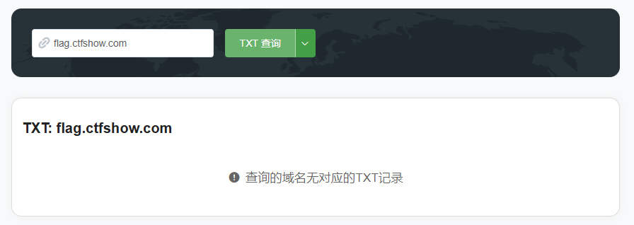
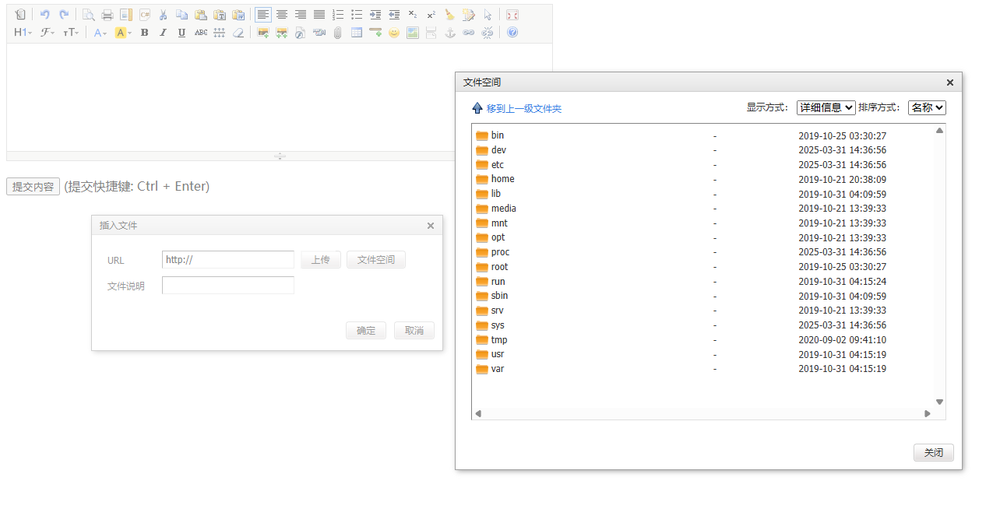

import Collapse from "../../components/mdx/Collapse.astro";
import Diff from "../../components/mdx/Diff.astro";
import Error from "../../components/mdx/Error.astro";
import Info from "../../components/mdx/Info.astro";
import Kbd from "../../components/mdx/Kbd.astro";
import Success from "../../components/mdx/Success.astro";
import Warning from "../../components/mdx/Warning.astro";
import TimeLine from "../../components/mdx/TimeLine.astro";
import LinkCard from "../../components/mdx/LinkCard.astro";

## Case1-注释

Flag在网页源代码**注释**中

## Case2-绕JS

**Javascript**前台拦截
- 使用<Kbd>Ctrl</Kbd>+<Kbd>U</Kbd>查看源代码
- 禁用**Javascript**

## Case3-抓包

直接抓包即可
```bash
HTTP/1.1 200 OK
Server: nginx/1.20.1
Date: Thu, 20 Mar 2025 13:11:46 GMT
Content-Type: text/html; charset=UTF-8
Connection: keep-alive
Flag: flag{xxx}
X-Powered-By: PHP/7.3.11
Access-Control-Allow-Methods: GET,POST,PUT,DELETE,OPTIONS
Access-Control-Allow-Credentials: true
Access-Control-Expose-Headers: Content-Type,Cookies,Aaa,Date,Server,Content-Length,Connection
Access-Control-Allow-Headers: DNT,X-CustomHeader,Keep-Alive,User-Agent,X-Requested-With,If-Modified-Since,Cache-Control,Content-Type,Authorization,x-auth-token,Cookies,Aaa,Date,Server,Content-Length,Connection
Access-Control-Max-Age: 1728000
Content-Length: 19

web3:where is flag?
```

## Case4-robots.txt

`/robots.txt`

```bash
User-agent: *
Disallow: /flagishere.txt
```

`/flagishere.txt`: Flag

`/robots.txt` 是一个文本文件，通常位于网站的根目录下，用于指示网络爬虫（如搜索引擎的爬虫）如何访问和抓取该网站的内容。它的主要作用是告诉爬虫哪些页面或目录可以抓取，哪些应该避免。

### 基本格式
`/robots.txt` 文件通常包含以下内容：

```bash
User-agent: [爬虫的名称]
Disallow: [不允许抓取的路径]
Allow: [允许抓取的路径]
```

- **User-agent**: 指定适用的爬虫名称。`*` 表示适用于所有爬虫。
- **Disallow**: 指定不允许爬虫访问的路径。可以是一个具体的路径或目录。
- **Allow**: 指定允许爬虫访问的路径。通常与 `Disallow` 一起使用，用于在禁止的目录中允许某些特定的路径。


## Case5-index.phps

```bash
<?php

/*
# -*- coding: utf-8 -*-
# @Author: xxx
# @Date:   xxx
# @Last Modified by:   xxx
# @Last Modified time: xxx
# @email: xxx@xxx.com
# @link: xxx

*/

//flag{xxx}
echo "where is flag ?" # 会直接在浏览器显示
```

### **index.php**
- **文件类型**: PHP 脚本文件。
- **用途**: 这是一个包含 PHP 代码的脚本文件，通常用于生成动态网页内容。当用户访问一个包含 `index.php` 文件的目录时，Web 服务器（如 Apache 或 Nginx）会执行这个文件，并将生成的 HTML 内容返回给用户的浏览器。
- **处理方式**: Web 服务器会解析并执行 `index.php` 文件中的 PHP 代码，然后将生成的 HTML 内容发送给客户端。

### **index.phps**
- **文件类型**: PHP 源代码文件。
- **用途**: 这是一个包含 PHP 源代码的文件，通常用于展示 PHP 代码的源代码，而不是执行它。`index.phps` 文件通常用于教学或文档目的，让开发者可以查看 PHP 代码的结构和内容。
- **处理方式**: 当用户访问 `index.phps` 文件时，Web 服务器不会执行其中的 PHP 代码，而是将其作为纯文本文件返回给客户端，显示源代码内容。

### **主要区别**
- **执行方式**: `index.php` 会被服务器执行并生成动态内容，而 `index.phps` 则会被视为纯文本文件，显示源代码。
- **用途**: `index.php` 用于生成动态网页，而 `index.phps` 用于展示 PHP 源代码。

### **Q & A**
那么在后台 管理员看到的index.php和index.phps是一样的吗?

查看 `index.php` 和 `index.phps` 时，**看到的内容是否一样**取决于管理员是通过什么方式查看这些文件的：


- 通过文件管理器或 FTP 查看文件内容是 **完全一样的**

- 通过浏览器访问文件看到的内容会 **不一样**

- 通过命令行查看文件内容是 **完全一样的**

## Case6-www.zip

访问 `www.zip` 即可

`www.zip` 是一个常见的文件名，通常用于压缩和打包网站的文件和目录。它可能包含网站的HTML文件、CSS样式表、JavaScript脚本、图片、以及其他相关资源。通过将这些文件压缩成一个 `.zip` 文件，可以方便地传输、备份或共享整个网站的内容。

### 用途
1. **网站备份**：开发者可能会将整个网站的内容打包成 `www.zip`，以便进行备份。
2. **网站迁移**：在将网站从一个服务器迁移到另一个服务器时，打包成 `.zip` 文件可以简化传输过程。
3. **文件共享**：将网站文件打包成 `.zip` 文件后，可以更容易地通过电子邮件或其他方式分享给他人。
4. **下载资源**：某些网站可能会提供 `www.zip` 文件供用户下载，以便离线查看或使用网站内容。

## Case7-.git

`.git` 文件夹是 Git 版本控制系统用来存储与版本控制相关的数据的目录，通常包括配置文件、对象文件和索引文件。正常情况下，`.git` 文件夹中不会有 `index.php` 文件。

不知道为什么，我访问 `index.php` 时，就拿到了flag

## Case8-.svn

与`Case7`类似，访问`.svn`
`.svn` 是 Subversion（SVN）版本控制系统的工作目录中的隐藏文件夹，类似于 Git 中的 `.git` 目录。这个文件夹包含了 SVN 用来管理版本控制的所有元数据和文件。

### 特点

- **隐藏目录**：在大多数操作系统中，`.svn` 是一个隐藏目录，默认情况下不会显示。
- **版本控制数据**：包含了所有版本控制相关的信息，如文件的历史版本、提交日志等。
- **每个子目录都有**：与 Git 不同，SVN 在工作副本的每个子目录中都会创建一个 `.svn` 目录。


## Case9-.swp

`"发现网页有个错别字？赶紧在生产环境vim改下，不好，死机了"`

访问`index.php.swp`


## Case10-cookie

在请求数据包cookie看到flag

## Case11-TXT 记录

**目前不会做**

也可能是坠机了



查询域名TXT记录 一般指为某个主机名或域名设置的说明

## Case12-信息搜集&robots.txt

查看`robots.txt`文件，找到后台登录地址，用户名admin。密码：在页面的最下方

## Case13-信息搜集

在页面下面发现 document 下载发现里面存在后台地址和用户名密码

## Case14-editor

访问`/editor`



可以读取整个服务器文件

## Case14-信息搜集

来自题解: 
访问/admin页面 发现有一个忘记密码操作，需要输入地址 在主页面下面看到QQ邮箱，通过QQ号查询邮箱，是西安的 修改密码成功，用户名 admin 登录成功获得flag